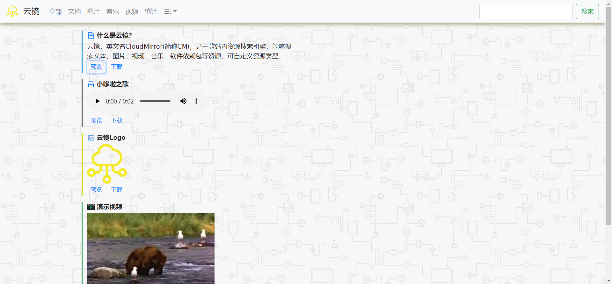
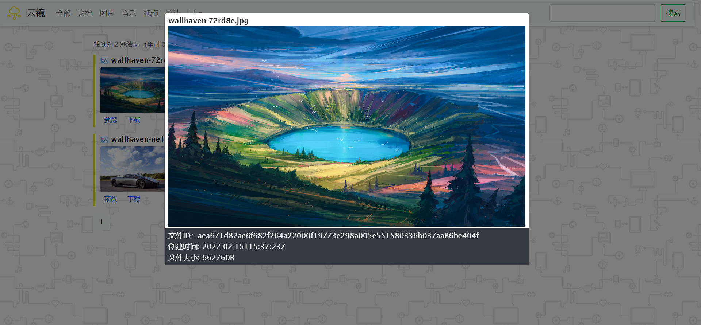

# CloudMirror
<p align="center"></p>
<b>云镜</b>，是一款微小的站内资源搜索引擎库，是一款基于Go语言开发，独立于开发项目之外，帮助WEB网站操作者快速搜索站资源的外部工具。它由Go语言开发且独立运行于服务器之上，开发者仅仅需提供图像文件存储路径，待程序初始化后,相关资源文件所在路径被将被全部收录于SQLite数据库中，并生成唯一的HASHID，采用链式绑定，方便使用者快速搜索图像资源。
<p align="center"></p>
<p align="center"></p>


# 项目依赖
- MinGW-w64-v8.1.0
- Go-v1.17.5
- BootStrap-v4.6.x
- JQuery-v3.6.0
- SQLite3

# 推荐的静态文件路径结构
```
asserts
│
│
└───audios
│   │   file01.mp3
│   │   file02.mp3
│   
└───videos
|    │   file01.mp4
|    │   file02.mp4
|
└───images
|    │   file01.png
|    │   file02.jpg
|    |   file03.jpge
|
└───docs
    │   file01.md
    │   file02.docx
    |   file03.txt
```